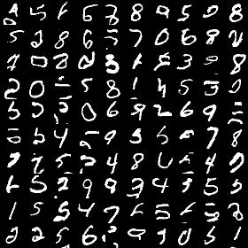
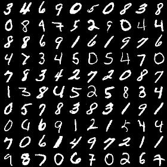

# Generating images pixel by pixel
###### Theano implementation of pixelCNN architecture
### This repository contains code for training an image generator using a slight variant of the pixelCNN architecture as described in [Conditional Image Generation with PixelCNN Decoders](https://arxiv.org/abs/1606.05328)

Most of the code is in core theano. 'keras' has been used for loading data. Optimizer implementation from 'lasagne' has been used.

Dependencies:

[theano](http://deeplearning.net/software/theano/install.html)

[lasagne](http://lasagne.readthedocs.io/en/latest/user/installation.html)

[keras](http://keras.io/#getting-started-30-seconds-to-keras)

You can use [experiments.sh](experiments.sh) to train the model and [install_dependencies.sh](install_dependencies.sh) to install the dependencies.

Notes on results:
1. Images with 2-bit depth has been considered for training as well as generation e.g. every pixel is quantized into four levels and then used for training. Four-way softmax has been used to predict pixel quantization.
2. Following is the result after 60 epochs of training which got completed in about 10 hrs on K6000 Gpu. No hyper parameter search has been performed. 

Generated images

Training images

Salient features: No blind spots, efficient implemenattion of vertical stacks and horizontal stacks, residual connections and good generation results :D

TODO: Implement gated activation and conditional generation.
